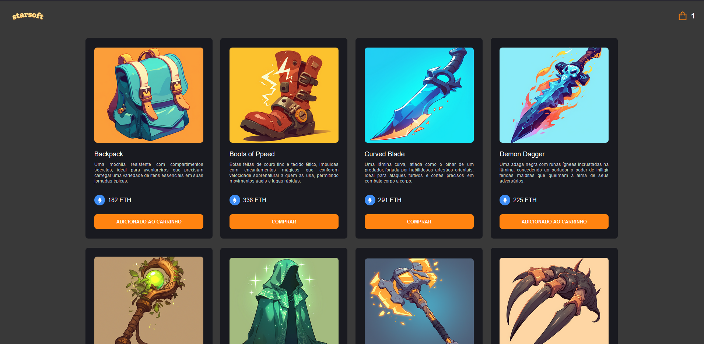

# Teste Starsfot - NextJS

 
 

## Scripts

Iniciar serviços web (Docker):

    - npm run services:up

Parar serviços web (Docker):

    - npm run services:down

Executar os testes(Jest):

    - npm run test

Executar verificação de formatação de código:

    - npm run lint:prettier:check

Executar correção de formatação de código:

    - npm run lint:prettier:fix

## Continuous Integration

Apenas para fins de demonstração deixei rodando 2 scripts no Github actions realizando CI do projeto, é um script que executado os testes e a verificação da formatação do código

Ambos estão com rules no github e o pullrequest só pode ser executado com o retorno positivo dos scripts

os arquivos estão em ./github/workflows.
